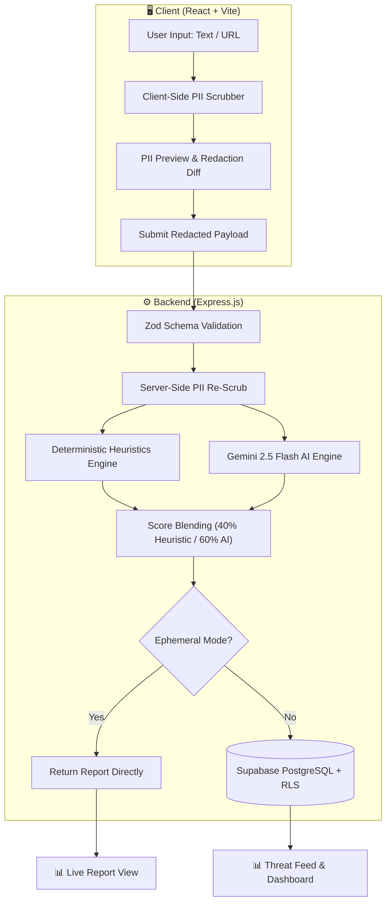

# 🛡️ TrustShield AI

> **Privacy-First Scam & Phishing Detection Platform** powered by Gemini AI and deterministic heuristic rule engines, backed by Supabase PostgreSQL with strict Row Level Security.

[](LICENSE)
[](https://react.dev/)
[](https://www.typescriptlang.org/)
[](https://vitejs.dev/)
[](https://expressjs.com/)
[](https://supabase.com/)
[](https://tailwindcss.com/)

---

## 🌟 Key Features

* **🔒 Privacy-Preserving Client Redaction**: Proprietary PII scrubber masks emails, credit cards, SSNs, phone numbers, and IBANs *locally in the browser* before transmission.
* **🧠 Multi-Layer Threat Intelligence**: Dual-engine architecture blending Gemini 2.5 Flash neural reasoning (60%) with deterministic heuristic rules (40%) across 25+ scam categories.
* **⚡ Ephemeral & Anonymized Mode**: Zero-log analysis option allows threat assessment without persisting raw or analyzed content.
* **🌐 Community Threat Feed**: Real-time crowd-sourced anonymized scam database with community upvoting.
* **📊 Visual Threat Reports**: High-impact interactive gauges, severity-graded red flags, tailored recovery checklists, and one-click PDF/JSON exports.
* **🛡️ Enterprise-Grade Security**: Helmet security headers, rate limiting, and Supabase Row Level Security (RLS) guaranteeing users only modify their own data.

---

## 🏗️ Architecture Overview



---

## 📁 Repository Structure

```text
trustshield-ai/
├── client/                     # Frontend (React 18, Vite, Tailwind CSS, Framer Motion)
│   ├── src/
│   │   ├── components/         # Reusable UI (Navbar, RiskGauge, RedFlagCard, etc.)
│   │   ├── pages/              # Landing, Analyze, Report, Feed, Dashboard, Privacy, About
│   │   ├── services/           # Backend API integration client
│   │   └── utils/              # Client-side PII scrubber, Supabase client
│   └── .env.example
│
├── server/                     # Backend API (Express.js, TypeScript, Helmet)
│   ├── src/
│   │   ├── config/             # Supabase admin client, Gemini AI config
│   │   ├── middleware/         # Auth, error handling, rate limiting
│   │   ├── routes/             # /analyze, /scans, /admin
│   │   ├── scripts/            # Database migration and seeding runners
│   │   ├── services/           # AI analysis, scan persistence, heuristics
│   │   └── utils/              # Heuristic engine, server-side PII sanitizer
│   └── .env.example
│
├── database/                   # Database schemas
│   ├── 001_initial_schema.sql  # Complete schema, RLS policies, triggers, RPCs
│   └── migrate.js              # Standalone migration verification script
│
├── shared/                     # Shared TypeScript schemas & validators
│   └── validators.ts
└── package.json                # Root workspace scripts
```

---

## 🚀 Quickstart Guide

### Prerequisites
* **Node.js**: v18+ (tested on v20 & v24)
* **npm**: v9+
* **Supabase Account**: (Free tier at [supabase.com](https://supabase.com))

### 1. Clone & Install Dependencies
```bash
git clone https://github.com/<your-username>/trustshield-ai.git
cd trustshield-ai

# Install root, server, and client dependencies
npm install --prefix server
npm install --prefix client
```

### 2. Configure Environment Variables

#### Backend (`server/.env`)
Copy `server/.env.example` to `server/.env`:
```ini
PORT=5000
NODE_ENV=development
GEMINI_API_KEY=your_gemini_api_key_here
SUPABASE_URL=https://your-project.supabase.co
SUPABASE_SERVICE_ROLE_KEY=your_supabase_service_role_key
CLIENT_URL=http://localhost:5173
```

#### Frontend (`client/.env`)
Copy `client/.env.example` to `client/.env`:
```ini
VITE_SUPABASE_URL=https://your-project.supabase.co
VITE_SUPABASE_ANON_KEY=your_supabase_anon_publishable_key
VITE_API_BASE_URL=http://localhost:5000/api/v1
```

### 3. Database Migration (Supabase)
Run the SQL migration in your Supabase SQL Editor:
1. Open the [Supabase Dashboard SQL Editor](https://supabase.com/dashboard).
2. Paste the contents of [`database/001_initial_schema.sql`](database/001_initial_schema.sql) and click **Run**.
3. Seed sample community threats:
   ```bash
   npm run db:seed
   ```

### 4. Run Development Servers
```bash
# Terminal 1: Start Express backend (port 5000)
npm run dev:server

# Terminal 2: Start React frontend (port 5173)
npm run dev:client
```
Visit **[http://localhost:5173](http://localhost:5173)** in your browser!

---

## 🧪 Testing & Verification

```bash
# Run complete test suite (Input validation + Threat workflows)
npm test

# Run production build validation
npm run build
```

---

## 🔒 Security & Privacy Policy

* **No Plaintext Logging**: Raw user input is never logged to disk or console.
* **RLS Enforcement**: Row Level Security is active on all exposed PostgreSQL tables.
* **Secret Protection**: Service role keys are strictly restricted to the backend and never packaged into frontend assets.

---

## 📄 License

This project is licensed under the [MIT License](LICENSE).
